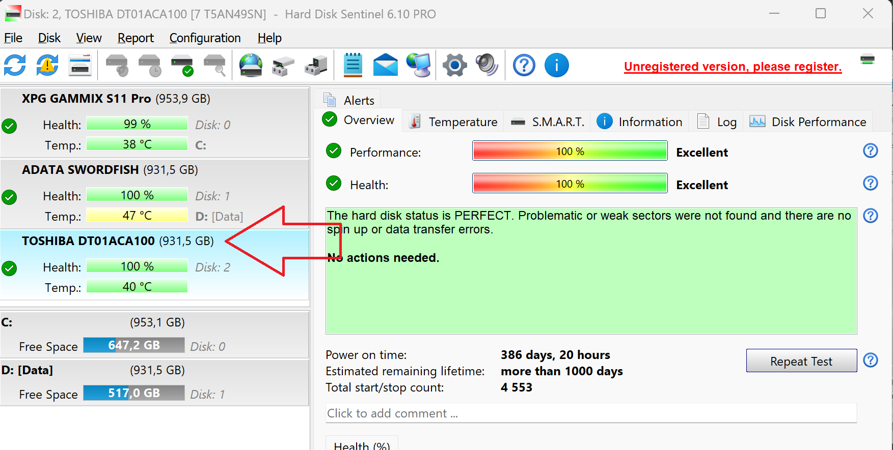

The purpose of this tutorial is to set up console version of HDsentinel on QNAP NAS,
enable scheduled execution and write the output to an accessible location in order to read it by the full version of HD Sentinel as described in https://www.hdsentinel.com/how_to_monitor_network_attached_storage_nas_status.php

# 1. Enable SSH login
1.1 Go to Telnet/ SSH in ControlPanel

1.2 Tick the "Allow SSH Connection"

1.3 Do not forget to Apply

# 2. Login with SSH

Recent Microsoft Windows 10/11 have SSH client built-in. If you dont have a SSH client - download PuTTY or something similar.

2.1 Connect to the NAS

`ssh -l <your_user_name> <nas_ip_address>`

2.2 You have to agree
(that the host is your NAS and NS.A/MO.SSAD/MI.5/K.GB... is not in the middle)
by typing `yes`

2.3 Enter your password when prompted

2.3 You have to be able to see the following screen:

Type `Q` + Enter

Type `y` + Enter

# 3. Download and test HD Sentinel console version

*Disclarmer: Some folks might argue that the following procedure is not secure enough and it would be better if HD Sentinel executable is moved to `/home/admin/.hdsentinel`. My train of thought is that if administrator level user is compromised is irrelevant which one exactly...*

3.1 Use the following code:  
`mkdir .hdsentinel` 
`cd .hdsentinel` 
`wget https://www.hdsentinel.com/hdslin/armv5/hdsentinelarm`  
`chmod +x hdsentinelarm`  
to:
- Create directory .hdsentinel (the "." symbol makes it hidden) in administrator's user home dir (It could be any directory, nevertheless **it has to be on a HDD** as QTS will not preserve on reboot files anywhere else).
- Download HD Sentinel by using WGET (**Warning**: In case of running x86 QNAP, use the appropriate executable for the platform x86 from https://www.hdsentinel.com/hard_disk_sentinel_linux.php)
- Make the file executable `+x`

**NOTE**: If you are running *x86* NAS do not forget to find the appropriate executable from the link above.

2.4 Perform a test run by typing `./hdsentinelarm` and the output will be something like this:

*If you see `Permission denied` probably the name of the executable has changed. Find it by typing `ls` and `chmod +x <newname>`.*

# 4. Run HDD sentinel on schedule

4.1 Find the absolute path of the HDsentinel executable:
`find $(pwd) -name hdsentinelarm`

Note the output will be something like:

you could try to find this folder symlinked in `/share/homes/<YOUR_USER>/.hdsentinel/`

4.2 I suggest to output the report file in the `Public` folder of the NAS in `/share/public/'

`/share/homes/<YOUR_USER>/.hdsentinel/hdsentinelarm -r /share/Public/report.html -html`

4.3 Add line in crontab file

`*/10 * * * * /share/homes/<YOUR_USER>/.hdsentinel/hdsentinelarm -r /share/Public/report.html -html`
(launch on every 10 minutes and write output to /share/Public/report.html)

By either:
- use `vi` to manually edit `/etc/config/crontab`
- or pipe `echo "*/10 * * * * /share/homes/<YOUR_USER>/.hdsentinel/hdsentinelarm -r /share/Public/report.html -html" >> /etc/config/crontab` to append the line

4.4 Reload CRONTAB

`crontab /etc/config/crontab && /etc/init.d/crond.sh restart`

The output will be something like:

# 5. Configure HD Sentinel by the graphic interface File -> Configure NAS Monitoring

End result:

# 6. Final words:

As of the time of writing (23 Jul 2023) running on QTS 5.0.1.2376 crontab schedule is working properly and the configuration survived reboot and QTS update. 
Whether future versions of QTS will treat `crontab` in consistent manner is unknown so if your setup stops updating search for autorun/crontab/etc. in the forums for the particular version.
"# qnap-arm-hdsentinel" 
